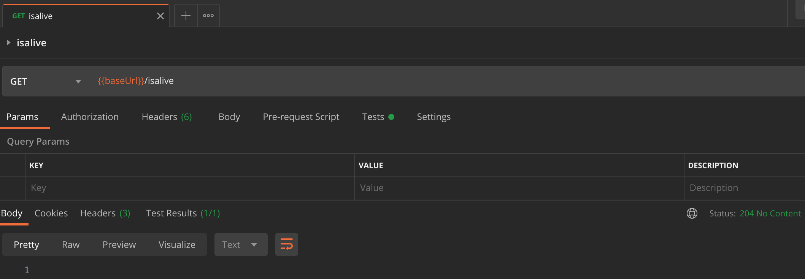
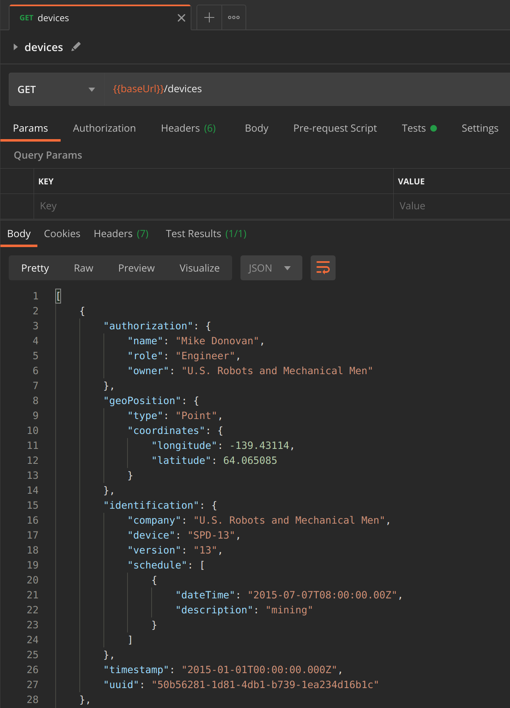
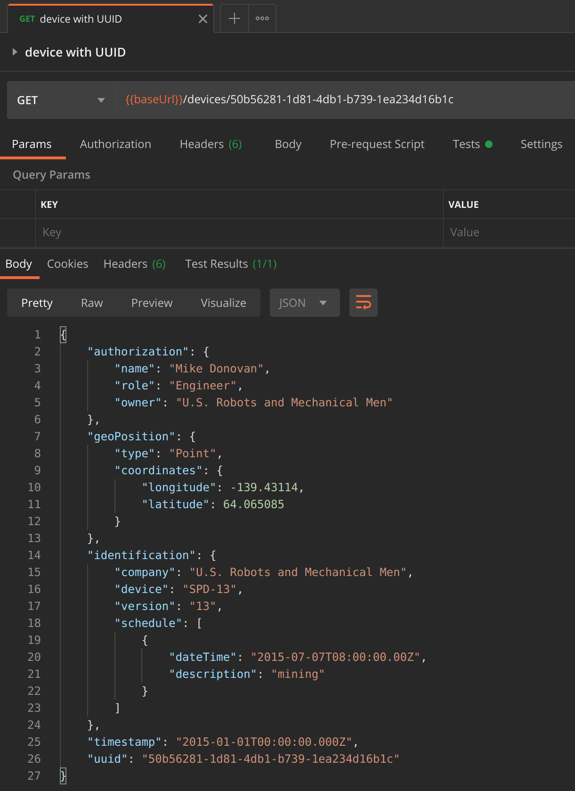
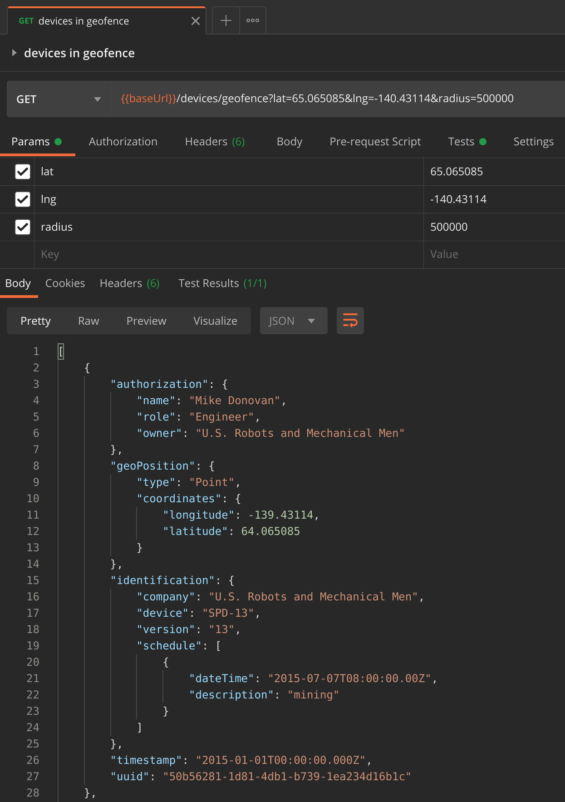

# iot-device-registry

iot-device-information publishes a register message to an MQTT Broker on startup. iot-device-registry subscribes
to a topic of that broker and saves the payload to the MongoDB. I am planning to create an API so that the data in the MongoDB
can be retrieved for further processing.

## Requirements

In order to use iot-device-registry you need the following setup:

* Node.js
* MongoDB
* MQTT broker

## Features

### Register

Subscribes to a topic of an MQTT broker. Received register messages are mapped and saved to a collection in a MongoDB.

### Is Alive

Checks whether the application is running.

* Request method: GET
* Endpoint: /isalive



### Devices

Returns detailed information about all devices.

* Request method: GET
* Endpoint: /devices



### Device

Returns detailed information about a device with a specific UUID.

* Request method: GET
* Endpoint: /devices/{uuid}



### Devices in Geofence

Returns detailed information about all devices within a certain area.

* Request method: GET
* Endpoint: /devices/geofence?lat={latitude}&lng={longitude}&radius={radius in meter}>



## Test

If you have trouble running the test "test:db", add the option "{ debug: true }" to "new MongoMemoryServer()" to find out more about the
reason. On ubuntu 18.04 for example the package "libcurl3" has to be installed in order to get the MongoMemoryServer started.

```javascript
mongoServer = new MongoMemoryServer({ debug: true });
```
